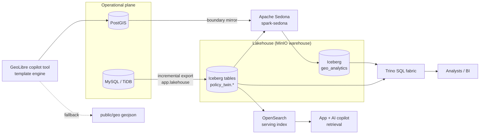

# Lakehouse (DM-4, ADR-005) + Trino analytical fabric (DM-5, ADR-006)

Canonical entities are exported from the operational MySQL store to an
**Apache Iceberg** lakehouse on MinIO/S3 (or a local warehouse dir) and
queried analytically through **Trino**.

## Export pipeline

`services/ingestion/app/lakehouse/` — PyIceberg-based, incremental:

```bash
cd services/ingestion
pip install -r requirements.txt -r requirements-extras.txt  # pyiceberg extra

# full export of one entity (first run is always full)
python -m app.lakehouse export --entity sector_metrics --full

# incremental (watermark = max(updated_at), persisted per entity)
python -m app.lakehouse export --entity sector_metrics

# dev/CI without MySQL: canonical JSONL input (loader shape, docs/LOADER.md)
python -m app.lakehouse export --entity sector_metrics --source-jsonl metrics.jsonl

# plan only — no writes, no state changes
python -m app.lakehouse export --entity sector_metrics --dry-run
```

Exported tables (namespace `policy_twin`, partitioned layouts):
`jurisdictions (country_code, admin_level)`, `sector_metrics (sector_code)`,
`opportunities (sector_code)`, `laws (category)`, `clauses (clause_type)`,
`simulation_runs (engine)`, `evidence_sources`, `budgets (fiscal_year)`,
`facilities (facility_type)`, `procurement_records (buyer)`.

Configuration (env):

| Var | Default | Purpose |
|-----|---------|---------|
| `LAKEHOUSE_WAREHOUSE` | `s3://policy-twin/lakehouse` | warehouse root (`file://…` for local) |
| `S3_ENDPOINT` / `S3_ACCESS_KEY` / `S3_SECRET_KEY` | MinIO compose values | S3-compatible storage |
| `LAKEHOUSE_CATALOG` | `sql` | `sql` (sqlite dev catalog) or `rest` (Nessie/Tabular; needs `LAKEHOUSE_REST_URI`) |
| `LAKEHOUSE_STATE_FILE` | `<artifacts>/lakehouse-state.json` | per-entity watermarks |

**Sandbox honesty:** the sandbox has no Docker and no pyiceberg install, so
unit tests mock the table writer and assert planning/record-mapping/watermark
behavior; a real PyIceberg round-trip test exists and is skipped unless the
`pyiceberg` extra is installed. Without pyiceberg the exporter falls back to
a partitioned JSONL preview writer (loudly logged) so the pipeline is still
fully exercisable.

## Trino

`infra/docker/docker-compose.yml` service `trino` (trinodb/trino, port 8080)
mounts `infra/docker/trino/catalog/iceberg.properties` (hadoop catalog on the
MinIO warehouse — no Hive metastore needed for dev; switch to
`iceberg.catalog.type=rest` for a shared catalog in staging/prod).

### Smoke query

Trino is profile-gated in compose (`profiles: ["lakehouse"]`) because nothing
in the app/ingestion runtime consumes it by default (no `TRINO_URL` consumer
in the codebase) — it is an opt-in analyst fabric:

```bash
docker compose -f infra/docker/docker-compose.yml --profile lakehouse up trino
docker exec -it $(docker ps -qf name=trino) trino
```

Scripted smoke check (skips cleanly when `TRINO_URL` is unset):

```bash
TRINO_URL=http://localhost:8080 node scripts/trino-smoke.mjs   # runs SHOW CATALOGS
```

```sql
SHOW TABLES FROM iceberg.policy_twin;
SELECT sector_code, count(*), avg(value)
FROM iceberg.policy_twin.sector_metrics
GROUP BY sector_code ORDER BY 2 DESC;
SELECT jurisdiction_id, fiscal_year, sum(amount)
FROM iceberg.policy_twin.budgets
GROUP BY 1, 2 ORDER BY 3 DESC;
```

(A `SHOW TABLES` after the first export proves the end-to-end path:
MySQL → export → Iceberg/MinIO → Trino.)

## Apache Sedona — lakehouse-scale geo compute

`services/ingestion/app/geo_analytics/sedona_jobs.py` runs the geo batch
analytics over the lakehouse. Two engines, one set of spatial semantics:

- **Sedona / PySpark** (production): reads boundary GeoJSON +
  the canonical `facilities` Iceberg export from the MinIO warehouse,
  runs distributed spatial joins (`ST_Contains` — facilities per LGA) and
  corridor-proximity aggregates (`ST_DWithin` against the seeded
  Lagos–Calabar corridor line), writes `policy_twin.geo_analytics`
  (Iceberg) via the Spark `lakehouse` hadoop catalog; parquet fallback when
  the catalog is unreachable.
- **Pure-Python** (offline/CI default): identical predicates
  (`point_in_feature`, `distance_to_line_km`, … — mirroring
  `api/queries/geo.ts`) executed without a JVM; parquet output when pyarrow
  is installed, else JSONL. Deterministic and seeded
  (`GEO_ANALYTICS_SEED`, default `20240801`; outputs sorted by natural keys
  so identical inputs give byte-identical files).

Run locally (no Spark needed):

```bash
cd services/ingestion
python -m app.geo_analytics.sedona_jobs \
  --boundaries ../public/geo/kaduna-lgas.geojson \
  --facilities /tmp/lakehouse/jsonl-preview/policy_twin/facilities \
  --corridor-km 50 --out /tmp/geo-analytics --engine python
```

Compose (opt-in `lakehouse` profile, notebook UI OFF — batch driver):

```bash
docker compose -f infra/docker/docker-compose.yml --profile lakehouse up spark-sedona
```

Kubernetes (documented, NOT part of the default kustomization):
`kubectl apply -f infra/k8s/base/sedona-job.yaml`.

### Trino: query the result

After a Sedona run lands `geo_analytics` in the warehouse:

```sql
SHOW TABLES FROM iceberg.policy_twin;   -- now includes geo_analytics
SELECT unit_id, name, facility_count
FROM iceberg.policy_twin.geo_analytics
ORDER BY facility_count DESC LIMIT 10;
SELECT name, centroid_distance_km, facility_count
FROM iceberg.policy_twin.geo_analytics
WHERE centroid_distance_km <= 50
ORDER BY centroid_distance_km;
```

## The full lakehouse picture

| Layer | Tech | Role |
|-------|------|------|
| Canonical snapshots | **Iceberg + MinIO** | versioned, partition-pruned exports of operational MySQL entities (`policy_twin.*`) |
| SQL fabric | **Trino** (profile `lakehouse`) | ad-hoc analytical SQL across Iceberg catalogs — no app runtime dependency |
| Geo compute | **Apache Sedona** (profile `lakehouse`, k8s job optional) | distributed spatial joins/proximity over the warehouse → `geo_analytics` |
| Serving index | **OpenSearch** | full-text/vector serving for the app + ai retrieval (`OPENSEARCH_URL` in `services/ai`); indexes are *derived* from canonical exports — see `services/ai/app/retrieval/vector_adapter.py` and docs/ARCHITECTURE.md. Cross-ref: OpenSearch is the read-optimized serving plane, never the system of record. |



## GeoLibre evaluation note

[GeoLibre](https://github.com/opengeos/GeoLibre) is evaluated as the future
AI-geo backend for the copilot. The integration is a **seam, not a
vendoring**: `services/ai/app/tools/geolibre_tool.py` POSTs the natural-
language question to `GEOLIBRE_URL/query` when configured and falls back to
a deterministic in-process template engine otherwise (every answer carries
an honest `geo_engine: "geolibre" | "template"` marker). See
docs/GEOSPATIAL.md §6.
